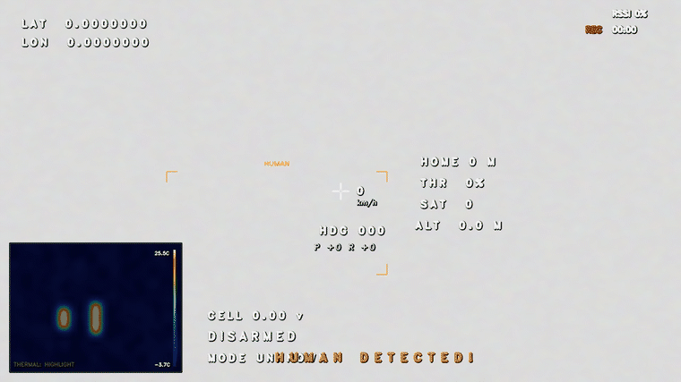
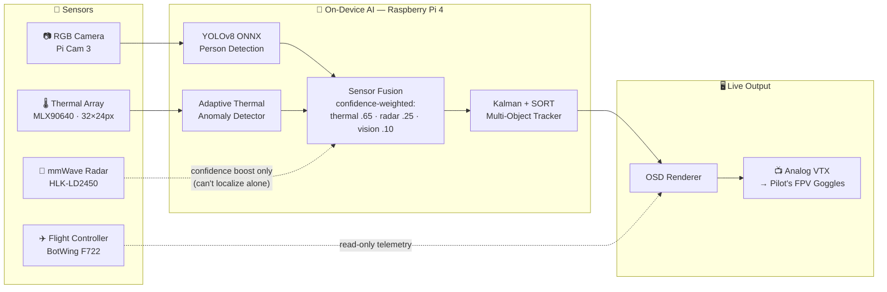
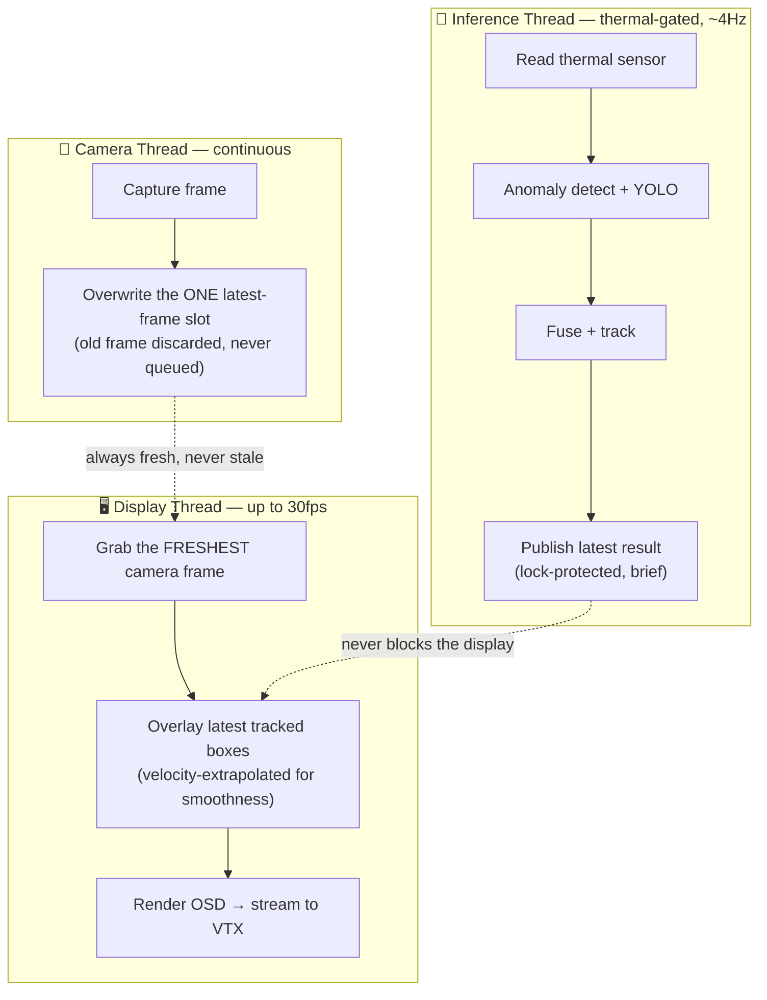

# 🚁 Rescue Drone v3
**Avalanche & Landslide Autonomous Human Detection System**


<p align="center">
  
</p>

Every second counts when someone is buried under snow or debris. That thought is what pushed us to build this.

**Rescue Drone v3** is something we poured a lot of late nights into — a fully autonomous, multi-sensor aerial system that can find survivors in avalanches and landslides when it's too dangerous or too slow for rescuers to search on foot. It fuses **thermal imaging, mmWave radar, and RGB vision** to detect human presence from above, runs completely offline on a Raspberry Pi 4, and beams a live augmented overlay straight to the pilot's goggles through an analog VTX.

No internet required. No fancy server. Just a drone, some clever sensor fusion, and the hope that it gets there in time.

<p align="center">
  
  <br>
  <sub><em>The actual live overlay, cycling through all three sensing modes — captured straight from the running system.</em></sub>
</p>

---

## 📖 Table of Contents

- [The Team](#-the-team)
- [How It Works](#%EF%B8%8F-how-it-works)
  - [End-to-end data flow](#end-to-end-data-flow)
  - [The concurrency trick: video that never stalls](#the-concurrency-trick-video-that-never-stalls)
  - [Deep dives](#-deep-dives)
- [Project Structure](#%EF%B8%8F-how-we-organized-the-code)
- [Wiring It All Together](#-wiring-it-all-together)
- [Getting the Pi Ready](#%EF%B8%8F-getting-the-pi-ready)
- [Launching the System](#-launching-the-system)
- [Why the Radar Changes Everything](#-why-the-radar-changes-everything)

---

## 👥 The Team

Four people, one shared obsession with getting this thing to actually work. Everyone brought something different to the table.

<table>
  <tr>
    <td align="center">
      <a href="https://github.com/AnujD21">
        <br><br>
        <b>Anuj D</b>
      </a><br>
      <sub>Software</sub>
    </td>
    <td align="center">
      <a href="https://github.com/asronal">
        <br><br>
        <b>Asronal</b>
      </a><br>
      <sub>Hardware & Integrations</sub>
    </td>
    <td align="center">
      <a href="https://github.com/vishal6626">
        <br><br>
        <b>Vishal</b>
      </a><br>
      <sub>Model Training</sub>
    </td>
    <td align="center">
      <a href="https://github.com/Akilan12335">
        <br><br>
        <b>Akilan S</b>
      </a><br>
      <sub>Hardware Assembly</sub>
    </td>
  </tr>
</table>

### 🎥 See It In Action

<p align="center">
  <a href="https://github.com/asronal/SkyNetics-rescue-drone/raw/main/assets/demo.mp4">
    
  </a>
  <br>
  <em>Click above to watch the full system demo</em>
</p>

---

## ⚙️ How It Works

### End-to-end data flow

Four sensors feed one fusion engine, which feeds one tracker, which feeds the OSD the pilot actually flies on. Nothing here talks to the cloud — every box below runs on the Pi itself.



**Why radar is dotted, not solid:** a 2-D FMCW radar like the LD2450 can tell you *something* is there and roughly how far, but it can't draw you a box. So it never creates a detection on its own — it only boosts the confidence of a thermal/vision hit that's already there, or logs a "possible deep burial" note when it sees presence with nothing visual or thermal to back it up.

### The concurrency trick: video that never stalls

This is the single most important engineering decision in the whole project, and the one most prototype detection drones get wrong: **the pilot's live video must never wait on the AI.** YOLO and thermal processing are comparatively slow (tens–hundreds of ms); if the video pipeline waited on them, the pilot would be flying on a stuttering feed — a real flight-safety hazard, not just an annoyance.

The fix is three independent threads that only ever hand off the *latest* value, never a queue:



If YOLO suddenly took 1 full second per frame, the **video would stay at ~30fps** — only the bounding-box update rate would drop. We proved this during development by artificially stalling inference and watching the display loop hold steady.

### 🔍 Deep dives

<details>
<summary><b>🌡️ How thermal detection works — no trained model, on purpose</b></summary>

<br>

At 32×24 pixels, the MLX90640 has too little spatial resolution for a trained model to be reliable — so instead we use **adaptive statistical thresholding**, which turns out to be both simpler and more robust at this resolution:

1. **Track the background, not the target.** An exponential moving average continuously estimates the *coldest* pixels' mean and standard deviation, deliberately excluding hot candidate regions so a person walking into frame doesn't drag the "background" temperature upward with them.
2. **Threshold above that adaptive baseline** — `background + max(1.5°C, 3σ)` — combined with a human body-temperature window (12–45 °C, loosened from the textbook 26–39 °C to tolerate clothing and indoor bench-testing).
3. **Shape-filter the result**: aspect ratio between 0.25–2.5, minimum blob area, morphological cleanup — rejects blobs that are the right temperature but the wrong shape to be a person (a sun-warmed rock, for instance).
4. **Confidence from thermal contrast** — the hotter a blob is above the adaptive background, the higher its confidence score, smoothed with its own EMA so it doesn't flicker frame to frame.

This lives in `ml/models.py`'s `AnomalyDetector`, with a second, silhouette-focused implementation in `ml/thermal_isolation.py` used for the on-screen thermal picture-in-picture.
</details>

<details>
<summary><b>👁️ How the RGB/YOLO detection works</b></summary>

<br>

A single-class ("person") **YOLOv8n** model, exported to **ONNX** and run via **ONNX Runtime** (with an OpenCV DNN fallback if ONNX Runtime fails to load on a given board). Every frame:

1. **Letterbox the frame** to 320×320 — pad to preserve aspect ratio rather than squashing the image, so a person's proportions aren't distorted before the model ever sees them.
2. **Run inference**, then **undo the letterbox math** to map boxes back to the original camera frame, then scale up to the display resolution — this is what keeps a box glued to the right spot on screen regardless of camera vs. display resolution.
3. **Confidence threshold is deliberately low (0.10)** — this detector is tuned to favor recall (catch partial/occluded people) on the assumption that sensor fusion downstream, not YOLO alone, is responsible for rejecting false positives.

Lives in `ml/models.py`'s `YOLODetector`. There's also a `cfg.yolo_letterbox` toggle to switch to plain stretch-resize preprocessing — useful if a differently-trained model ever expects that instead.
</details>

<details>
<summary><b>🔀 How sensor fusion decides "human detected"</b></summary>

<br>

Thermal and RGB detections are merged by IoU (intersection-over-union): overlapping boxes from both sensors count as corroborating evidence for the same person; non-overlapping detections are kept independently. Confidence weights reflect how much we trust each modality for *this specific scenario*:

| Sensor | Weight | Why |
|---|---|---|
| Thermal | **0.65** | Primary — works with zero light, sees through light debris |
| Radar | **0.25** | Confirmation boost — works through snow/fog where cameras can't |
| RGB/Anomaly | **0.10** | Supporting signal |

A radar hit boosts the confidence of a detection that's already there. Radar presence with **nothing** thermal or visual to back it up doesn't invent a box — it logs a "possible deep burial" note instead, since a 2-D radar genuinely can't localize precisely enough to draw one honestly.

Lives in `ml/models.py`'s `SensorFusion`.
</details>

<details>
<summary><b>🎯 How tracking keeps a person's ID stable</b></summary>

<br>

A SORT-style tracker: each tracked person gets a **7-state linear Kalman filter** (`x, y, scale, aspect ratio` + their velocities) that predicts where they'll be next frame. New detections are matched to existing tracks by IoU using the Hungarian algorithm (`scipy.optimize.linear_sum_assignment`, with a greedy fallback if SciPy isn't installed).

A few refinements on top of vanilla SORT:
- **Re-entry graveyard** — a person who briefly leaves frame or gets occluded gets their *same* ID back instead of being double-counted as a new survivor.
- **EMA box smoothing** — displayed boxes are exponentially smoothed, not raw detection output, so they don't jitter.
- **Velocity extrapolation between inference cycles** — since new detections only arrive ~4×/second but video renders up to 30fps, each box is projected forward using its own recent velocity so it glides instead of snapping.

Lives in `ml/models.py`'s `HumanTracker` / `_Track`, with the display-side extrapolation in `display/rescue_display.py`.
</details>

<details>
<summary><b>⚡ How we keep video at ~30fps no matter how slow the AI is</b></summary>

<br>

Beyond the three-thread split above, a few specific bottlenecks had to be found and fixed by hand:

- **ONNX Runtime was starving the other threads.** It was configured to use all 4 of the Pi's CPU cores for every YOLO call — technically independent threads still need an actual core to run on, so the camera/display threads were getting starved during every ~200ms inference call. Capped to 2 threads, leaving headroom.
- **The OSD was doing ~20 full-frame color-space conversions per frame.** Each on-screen text element (there are about twenty — telemetry, FPS, alerts, per-person labels) was independently round-tripping the whole 1280×720 frame through PIL. Batched into a single conversion pass — roughly a 7× speedup on that code path alone.
- **The thermal picture-in-picture was reprocessing itself 7–8× more than necessary.** It re-ran the full adaptive-threshold pipeline on every display tick (~30fps) even though the underlying thermal frame only actually changes at ~4fps. Now cached per real inference frame.
- **Redundant sensor reads on throwaway cycles.** The inference loop polls the thermal sensor faster than the sensor actually refreshes; the camera and radar were being read (and copied!) even on cycles that were about to be discarded. Reordered so those reads only happen once we know the cycle will be used.
</details>

<details>
<summary><b>🐛 Real bugs we found (and fixed) building this</b></summary>

<br>

Left here because they're the kind of thing that'll bite anyone building something similar:

- **IMX708 camera driver bug** — requesting a low-resolution camera stream silently drops every frame due to a phase-detection-autofocus metadata parsing bug in libcamera. Fixed by forcing the sensor's full-frame native readout and letting the ISP hardware-scale down for free.
- **LD2450 radar sign-decode bug** — the radar encodes X/Y/speed as sign-magnitude (bit 15 = sign flag), not two's complement. Decoding it as a plain signed integer flipped the sign of every "positive" (i.e. most) reading, so real targets were silently failing the presence check.
- **Tracker hit-streak bug** — a track's "consecutive hits" counter was being reset every single frame regardless of whether it actually matched that frame, capping it at 1 forever. Invisible with the default settings, but would have silently broken the anti-flicker confirmation logic the moment anyone tuned it.
- **Aspect-ratio mismatch** — the camera captured 4:3 but the display canvas was 16:9, so every frame was being non-uniformly stretched before it ever reached the pilot's eyes. Boxes were technically aligned to the stretched video, but the video itself looked subtly wrong.
- **OSD color channel swap** — the on-screen alert colors were being run through a BGR→RGB conversion meant for a different part of the codebase, so "red" alerts rendered blue and the orange "HUMAN DETECTED!" banner rendered blue-ish.
</details>

---

## 🗂️ How We Organized the Code

One of the things we were most careful about was keeping everything modular. The AI pipeline, the display layer, and the hardware drivers don't know much about each other — which saved us a ton of headaches when a sensor misbehaved or we needed to swap out a model. Each piece does its job and gets out of the way.

<p align="center">
  
</p>

```text
rescue_drone_osd_fixed/
├── main.py                    # Where everything kicks off
├── config.py                  # Central hub for all tuning — thresholds, pinouts, sizes
├── rescue_drone.service       # Systemd service so the drone boots straight into mission mode
├── requirements.txt           # Python dependencies
│
├── pipeline/                  
│   └── detection_pipeline.py  # The orchestrator — syncs all sensors & AI every single frame
│
├── display/                   
│   ├── rescue_display.py      # Fullscreen OpenCV UI with PiP overlays
│   └── osd.py                 # Draws telemetry, bounding boxes, and the radar scope
│
├── ml/                        
│   ├── models.py              # YOLO detector, thermal anomaly scanner, SORT tracker, sensor fusion
│   ├── thermal_isolation.py   # Cleans up thermal noise so real heat signatures stand out
│   └── detection.py           # Shared Target dataclass passed through the whole pipeline
│
├── sensors/                   
│   ├── rgb_camera.py          # Pi Cam 3 feed via libcamera
│   ├── thermal_camera.py      # Reads & decodes the MLX90640 over I2C
│   ├── ld2450_radar.py        # Parses the LD2450's UART data stream
│   └── flight_controller.py   # Pulls MAVLink telemetry from the BotWing F722
│
├── models/                    # Drop your .onnx weights here (e.g. rgb_human.onnx)
└── output/                    # Auto-snapshots and mission recordings go here
```

---

## 🔌 Wiring It All Together

Getting the hardware right was honestly half the battle. Here's exactly how everything connects.

### 1. Analog VTX Output (Composite Video)

The Pi 4's 3.5mm TRRS jack carries a composite video signal. Wire it to your VTX and the OSD appears live in the pilot's goggles — no HDMI capture card, no latency, just analog video the way FPV was meant to be.

* **Tip**: Audio Left
* **Ring 1**: Audio Right
* **Ring 2**: GND `➔ VTX Ground`
* **Sleeve**: Video `➔ VTX Video-IN`

> **Important:** The Pi 4 turns composite output off by default. Add these two lines to `/boot/firmware/config.txt` to enable it:
> ```
> enable_tvout=1
> sdtv_mode=2   # PAL — switch to 0 for NTSC regions
> ```

### 2. MLX90640 Thermal Sensor (I2C)

<p align="center">
  
</p>

The thermal array is the heart of the survivor detection pipeline. It connects over I2C — dead simple wiring.

* **VCC** `➔` Pin 1 (3.3V)
* **GND** `➔` Pin 6 (GND)
* **SDA** `➔` Pin 3 (GPIO 2, I2C1)
* **SCL** `➔` Pin 5 (GPIO 3, I2C1)

### 3. HLK-LD2450 mmWave Radar (UART0)

* **TX** `➔` Pin 10 (GPIO 15, UART0 RX)
* **RX** `➔` Pin 8  (GPIO 14, UART0 TX)
* **VCC** `➔` Pin 2  (5V)
* **GND** `➔` Pin 14 (GND)

> You'll need to disable onboard Bluetooth to free up UART0. Worth it — the radar adds a whole extra dimension to detection confidence.

### 4. BotWing F722 Flight Controller (UART1 or UART2)

* **F722 TX** `➔` RPi RX (GPIO 1 / Pin 28 for UART2)
* **F722 RX** `➔` RPi TX (GPIO 0 / Pin 27 for UART2)
* **GND** `➔` Shared GND

> In iNav, head to the Ports tab and enable MSP on this UART at 115200 baud.

### 5. Pi Camera Module 3 (CSI)

Ribbon cable into the primary `CAM` port. Silver contacts face the HDMI ports. That's it.

---

## 🛠️ Getting the Pi Ready

We ran this on a freshly imaged Pi 4 with Raspberry Pi OS Lite. Here's the full setup from scratch:

```bash
# 1. Update everything and grab the system-level drivers
sudo apt update
sudo apt install -y python3-opencv python3-picamera2 python3-pip

# 2. Install the Python packages
pip3 install -r requirements.txt
pip3 install onnxruntime filterpy scipy pyserial
pip3 install adafruit-circuitpython-mlx90640 adafruit-blinka

# 3. Lock the CPU to performance mode — don't skip this
#    Without it the Pi throttles under load and the AI pipeline slows to a crawl
sudo apt install cpufrequtils
sudo cpufreq-set -g performance

# 4. Verify everything showed up correctly
i2cdetect -y 1                  # Look for 0x33 — that's the MLX90640
ls /dev/ttyAMA0                 # Should exist if the radar is wired in
libcamera-hello --list-cameras  # Should list IMX708 (Pi Cam 3)
```

---

## 🚀 Launching the System

The default launch goes straight to fullscreen. The display is tuned to fill the composite output without any desktop UI bleeding in — exactly what you want when it's streaming to goggles.

```bash
# Standard flight deployment
python3 main.py

# With live FC telemetry from the flight controller
python3 main.py --fc-enabled

# Windowed mode — great for development over VNC
python3 main.py --no-fullscreen

# Record the full mission to disk
python3 main.py --record

# SSH session, no display output needed
python3 main.py --headless

# No hardware nearby? Synthetic data mode lets you test the full pipeline
python3 main.py --demo
```

### Keyboard Shortcuts

Handy when you're testing over VNC or have a keyboard plugged in:

| Key | Action |
|-----|--------|
| `V` | Cycle main view: RGB → Thermal → Radar |
| `T` | Toggle the thermal picture-in-picture |
| `M` | Cycle thermal isolation mode (Highlight / Silhouette / Contour) |
| `S` | Save a snapshot to `output/` |
| `Q` | Quit |

---

## 📡 Why the Radar Changes Everything

<p align="center">
  
</p>

Adding the **LD2450** was one of those decisions that made the whole system feel significantly more capable. Cameras — thermal or RGB — need line-of-sight. The radar doesn't. It can detect the micro-movement of a person breathing through snow or debris, which is exactly the scenario we're building for.

It also tracks targets through fog, smoke, and whiteout conditions where the cameras are essentially useless.

That said, we're realistic about what it can and can't do. It won't give you a 3D point cloud, it can't image anything, and it's not a replacement for the thermal array. We use it as a **presence confirmation layer** inside `SensorFusion` — when the thermal or RGB detection is borderline, a radar hit tips the confidence scale. When all three agree, you've found your survivor.

---

<p align="center">
  <em>"The goal was never to build something impressive. It was to build something that could save a life."</em>
</p>

---

*Built with a lot of care, more than a few all-nighters, and the hope that this kind of technology actually makes it into the hands of rescue teams someday. If you're working on something similar or want to build on top of this — reach out.*
